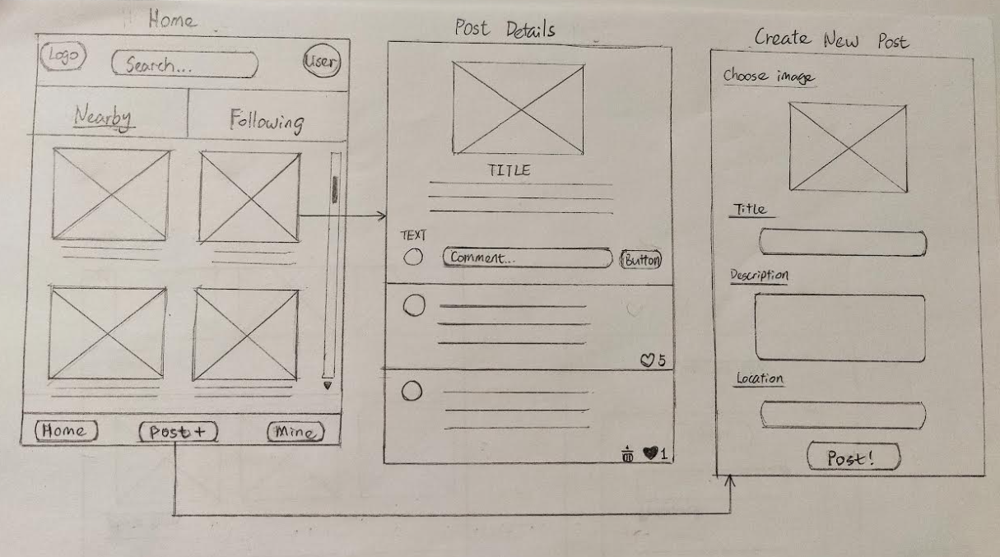

# SettleSmart App

## Overview

What is your app? Brief description in a couple of sentences.
- My application serves as a living and shopping guide, particularly designed for immigrants and travelers. It's a user based app, similar to facebook, but with additional features, allowing anyone to share, view, comment, collect the posts that are helpful or align with their interests.

### Problem

Why is your app needed? Background information around any pain points or other reasons.
- As an immigrant myself, I faced challenges with a limited social circle upon arriving in this country. When it came to fixing things at home, I often felt lost about which tools to use and where to find them. Likewise, when my familiar medicines ran out, I struggled to identify alternatives available in my new surroundings.

- I envision an app where fellow immigrants or seasoned travelers residing here share insightful posts addressing these very issues. Such a platform would enable me to swiftly locate necessary items or information. I could engage with helpful posts by commenting and connecting with individuals facing similar circumstances. Additionally, I could organize and save posts for easy retrieval in the future, thereby streamlining my daily life and promoting efficiency and convenience.

### User Profile

Who will use your app? How will they use it? Any special considerations that your app must take into account.
- My app is accessible to everyone, but immigrants and travelers will find it particularly useful and appealing.
- Special considerations: 
    - Multilingual Support: Given that immigrants from various backgrounds may use the app, it should support multiple languages.
    - Cultural Sensitivity: The app should be culturally sensitive and avoid any content that may be offensive or insensitive to users from different cultural backgrounds.
    - Privacy and Security: Implement robust measures to protect user data and privacy, especially considering the sensitive nature of some user-generated content.

### Features

List the functionality that your app will include. These can be written as user stories or descriptions with related details. Do not describe _how_ these features are implemented, only _what_ needs to be implemented.
- 2 main tabs on home page: nearby tab and following
    - nearby tab: displays posts from users who are geographically nearby the current user.
    - following tabs: displays posts created by users whom the current user follows.
- Create new post: Users can create a post with pictures, a title, description, and location.
- Comment posts: Users have the ability to comment on posts, like others' comments, and delete their own comments.
- Categorize collected posts: Users can gather all posts they find useful and create category names to organize them. They can then separate collected posts into these categories for easy access in the future.

## Implementation

### Tech Stack

List technologies that will be used in your app, including any libraries to save time or provide more functionality. Be sure to research any potential limitations.
- technologies: html, css, sass, javascript, express, react, node, sql
- libraries to save time: knex 
- libraries to provide more functionality: axios, react-router-dom, dotenv, multer(for image uploads)

### APIs

List any external sources of data that will be used in your app.
- For nearby tab, I'll use Google map API; for the posts, I'll create my own API

### Sitemap

List the pages of your app with brief descriptions. You can show this visually, or write it out.
- login page: login with username and password; sign up button available
- main page: 2 main tabs, "following" and "nearby"; search bar allow searching posts by keywords; button to create new post; Button for collecting posts and put them in catogories
- page to display a post details, post comments under post, like button and delete buttons available for comments
- page to create a new post
- page to see categorized collections, button to create category name 

### Mockups

Provide visuals of your app's screens. You can use tools like Figma or pictures of hand-drawn sketches.

### Data

Describe your data and the relationships between them. You can show this visually using diagrams, or write it out. 
(users table, posts table, comments table, collections table) 

### Endpoints

List endpoints that your server will implement, including HTTP methods, parameters, and example responses.
- HTTP methods: get users; get posts; get comments; put posts, put comments; put collection name

### Auth

Does your project include any login or user profile functionality? If so, describe how authentication/authorization will be implemented.
- It includes login. 
 - Client side auth: use JWT library, send JWT to server
 - Server side auth: receive JWT from client side and verity it on server side

## Roadmap

Scope your project as a sprint. Break down the tasks that will need to be completed and map out timeframes for implementation. Think about what you can reasonably complete before the due date. The more detail you provide, the easier it will be to build.
- Home page: 
    - Nearby and Following tabs/pages (8 hours for ui and functionality)
- PostDetails page:
    - show post details with picture, title, descriptions, location, and CommentList; collect a post, select category (5 hours for ui and functionality)
    - leave Comment, like and delete comment (1 hour for functionality)
- CreateNewPost page: choose image, enter title, description and location; post function (5 hours for ui and        functionality)
- CollectionCategories page: display 3 categories with 4 posts in each category, create category name function, change one post category from to another (5 hours for ui and functionality)
- API of posts: at least 50 posts (add 5-8 posts every day)
- Login page: create and finish in 1 day

## Nice-to-haves

Your project will be marked based on what you committed to in the above document. Under nice-to-haves, you can list any additional features you may complete if you have extra time, or after finishing.
 - User login/auth 
 - search bar for collections page
 - picture carousels in a post
 - My posts page to display all posts created by user
 - Geo/Google Map API for "nearby" functionality
 - App can be switched to multiple languages such as English, French, Chinese, ...
