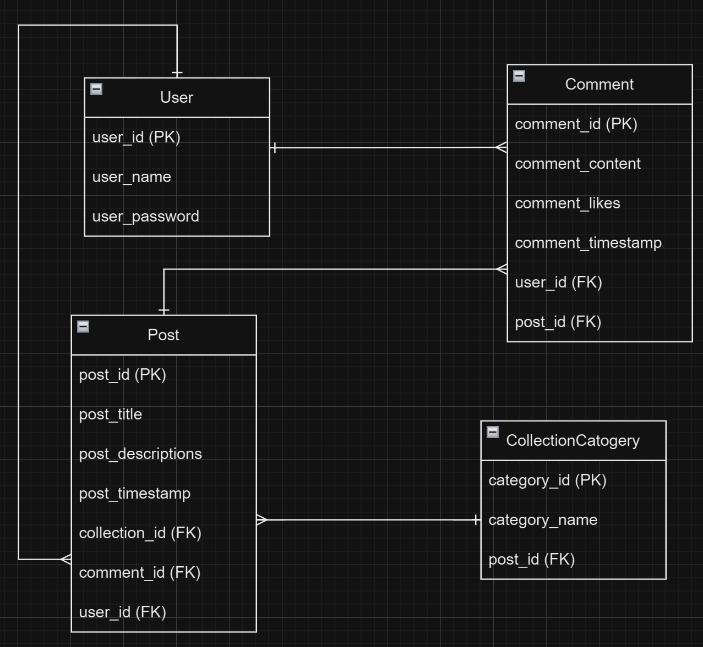

# SettleSmart App

## Overview

What is SettleSmart app? 
- SettleSmart app serves as a living and shopping guide, particularly designed for immigrants and travelers. It's user based, similar to facebook, but with additional features, allowing anyone to share, view, comment, collect the posts that are helpful or align with their interests.

### Problem

Why is SettleSmart needed?
- As an immigrant myself, I faced challenges with a limited social circle upon arriving in this country. Furthermore, when it came to fixing things at home, I often felt lost about which tools to use and where to find them. Likewise, when my familiar medicines ran out, I struggled to identify alternatives available in my new surroundings.

- I envision this app where fellow immigrants or seasoned travelers residing here share insightful posts addressing these very issues. Such a platform would enable me to swiftly locate necessary items or information. I could engage with helpful posts by commenting and connecting with individuals facing similar circumstances. Additionally, I could organize and save posts for easy retrieval in the future, thereby streamlining my daily life and promoting efficiency and convenience.

### User Profile

Who will use SettleSmart app? How will people use it? What special considerations that SettleSmart app must take into account:
- SettleSmart app is accessible to everyone, but immigrants and travelers will find it particularly useful and appealing.
- Special considerations (to be implemented in the future): 
    - Multilingual Support: Given that immigrants from various backgrounds may use the app, it should support multiple languages.
    - Cultural Sensitivity: This app should be culturally sensitive and avoid any content that may be offensive or insensitive to users from different cultural backgrounds.
    - Privacy and Security: Implement robust measures to protect user data and privacy, especially considering the sensitive nature of some user-generated content.

### Features

List of the functionalities that SettleSmart app will include:
- 2 main tabs and a search bar on home page:
    - nearby tab: displays posts from users who are geographically nearby the current user.
    - explore tabs: displays posts that the user may be interested or needed.
    - search bar: user can search posts by key words.
- Create new post: Users can create a post by uploading pictures, provide a title, description, and location for the post.
- Comment posts: Users can leave comments under posts, like others' comments, and delete their own comments.

## Implementation

### Tech Stack

List of technologies that are used in SettleSmart app:
- technologies: html5, css3, sass, javascript, react, express, node, mysql
- libraries to save time: knex 
- libraries to provide more functionality: axios, react-router-dom, dotenv, multer, uuid, cors

### APIs

External sources of data that is used in SettleSmart app:
- Nearby tab on Home page used Google map API
- PostDetails page used Google Places API for location autocomplete functionality

### Sitemap

All pages of SettleSmart app and brief descriptions:
- Home page: 2 main tabs, "nearby" and "explore"; search bar allow searching posts by keywords; button to create new post
- PostDetails page: displays details for a post including title, content, location, post comments under post, like and delete buttons available for comments
- PostAdd page: create a new post
- UserPosts page to see user's posts

### Mockups

Visuals of SettleSmart app's screens:
Home Page:

PostDetails Page:

CreateNewPost Page:

User's Posts Page:

### Data

Describe of SettleSmart data and the relationships between them:
(users table, posts table, comments table, collections table) 

### Endpoints

Endpoints that SettleSmart server will implement, including HTTP methods, parameters, and example responses.
1. GET /posts:
    - HTTP Method: GET
    - Example Response:
    [
        {
            "id": 1,
            "user_name": "JohnDoe",
            "post_title": "Sample Post",
            "post_content": "This is a sample post content.",
            "post_collects": 10,
            "post_image": "http://localhost:8080/images/sample_image.jpg",
            "post_location": "New York"
        },
        // More posts...
    ]

2. POST /posts: 
    - HTTP Method: POST
    - Parameters:
        - user_id (required): ID of the user creating the post.
        - post_title (required): Title of the post.
        - post_content (required): Content of the post.
        - post_collects: Number of collects for the post.
        - post_image (file): Image file for the post.
        - post_location: Location of the post.
    - Example Response:
    {
        "id": 123,
        "user_id": 456,
        "post_title": "New Post",
        "post_content": "This is the content of the new post.",
        "post_collects": 0,
        "post_image": "http://localhost:8080/images/new_image.jpg",
        "post_location": "Los Angeles"
    }
3. GET /posts/:id:
    - HTTP Method: GET
    - Parameters: id (required): ID of the post.
    - Example Response:
    {
        "id": 123,
        "user_name": "JaneDoe",
        "post_title": "New Post",
        "post_content": "This is the content of the new post.",
        "post_collects": 0,
        "post_image": "http://localhost:8080/images/new_image.jpg",
        "post_location": "Toronto",
        "post_latitude": 43.6532,
        "post_longitude": -79.3832,
    }

4. GET /posts/:id/comments:
    - HTTP Method: GET
    - Parameters: id (required): ID of the post.
    - Example Response:
    [
        {
            "id": 1,
            "user_id": 123,
            "user_name": "JohnDoe",
            "user_icon": "http://localhost:8080/icons/john_icon.jpg",
            "comment": "This is a sample comment.",
            "comment_likes": 5
        },
        // More comments...
    ]

5. POST /posts/:id/comments:
    - HTTP Method: POST
    - Parameters:
        - id (required): ID of the post.
        - user_id (required): ID of the user posting the comment.
        - comment (required): Content of the comment.
    - Example Response:
    {
        "id": 123,
        "post_id": 456,
        "user_id": 789,
        "comment": "This is a new comment.",
        "comment_likes": 0
    }

6. DELETE /posts/:id/comments/:commentId:
    - HTTP Method: DELETE
    - Parameters:
        - id (required): ID of the post.
        - commentId (required): ID of the comment to be deleted.
    - No Content Response

### Auth

Login or user profile functionality:
- Current project doesn't include user login or auth.
- It's listed in "Nice-to-haves" below, which will includes login:
 - Client side auth: use JWT library, send JWT to server
 - Server side auth: receive JWT from client side and verity it on server side

## Roadmap

Scope SettleSmart project as a sprint. Break down the tasks that will need to be completed and map out timeframes for implementation. Think about what can be reasonably complete before the due date.
- Home page: 
    - Nearby and Following tabs/pages (8 hours for ui and functionality)
- PostDetails page:
    - show post details with picture, title, descriptions, location, and CommentList; collect a post, select category (5 hours for ui and functionality)
    - leave Comment, like and delete comment (1 hour for functionality)
- CreateNewPost page: choose image, enter title, description and location; post function (5 hours for ui and        functionality)
- API of posts: at least 30 posts (add 5 posts every day)

## Nice-to-haves

Any additional features I may complete if I have extra time, or after finishing:
- Categorize collected posts: Users can gather all posts they find useful and create category names to organize them. They can then separate collected posts into these categories for easy access in the future.
 - User login/auth, sign up functionality for existing user
 - Button for collecting posts and put them in user's collections page
 - picture carousels in a post
 - App can be switched to multiple languages such as English, French, Chinese, ...

## Installation Guide:
1. Prerequisites: npm 

2. Installation Steps:
    - Cloning the repository: git clone <repository-url>
    - Installing dependencies: npm install 

3. Configuration
    - Environment variables and API keys:
        - REACT_APP_BASE_URL = "value"
        - REACT_APP_GOOGLE_MAP_API_KEY = "value"
        - REACT_APP_MAP_ID = "value"

4. Running the app:
    - Runs the app in the development mode: npm start
    - Open http://localhost:3000 to view it in your browser. The page will reload when you make changes.